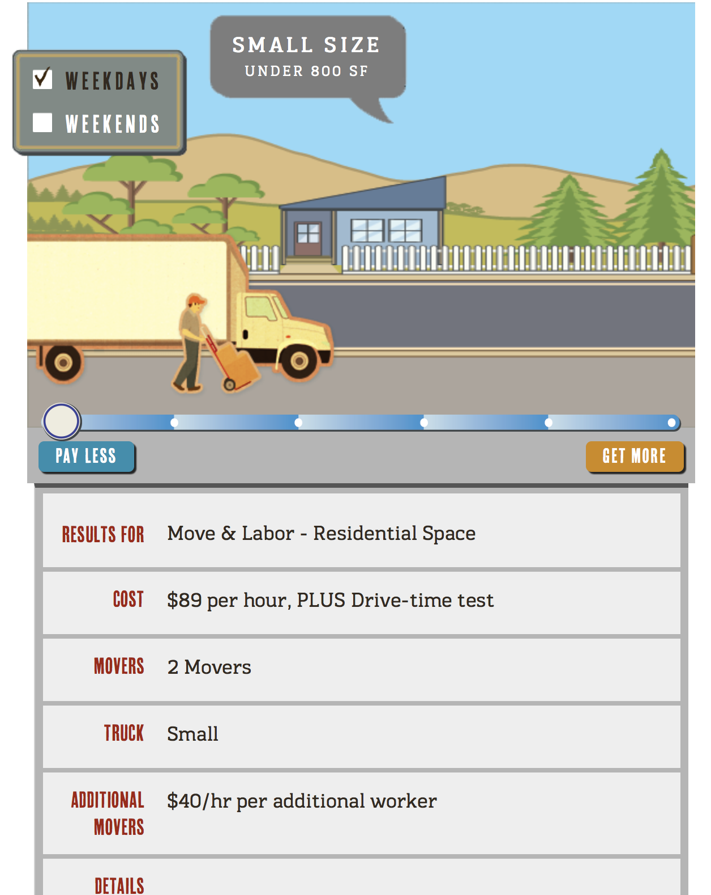
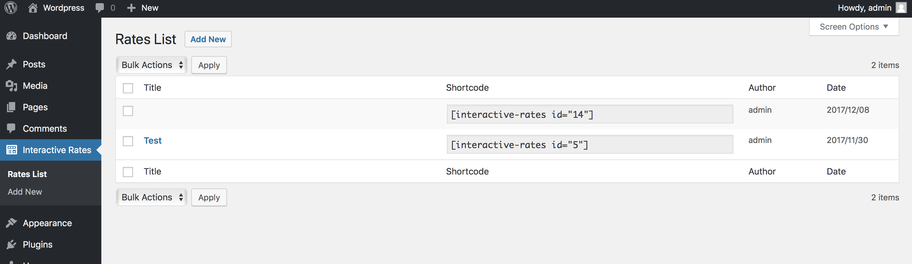
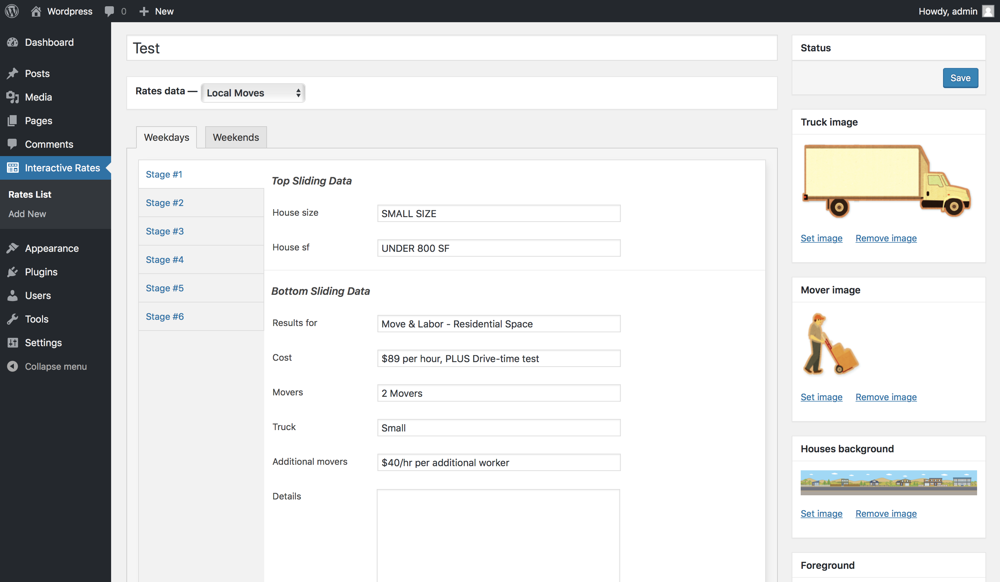
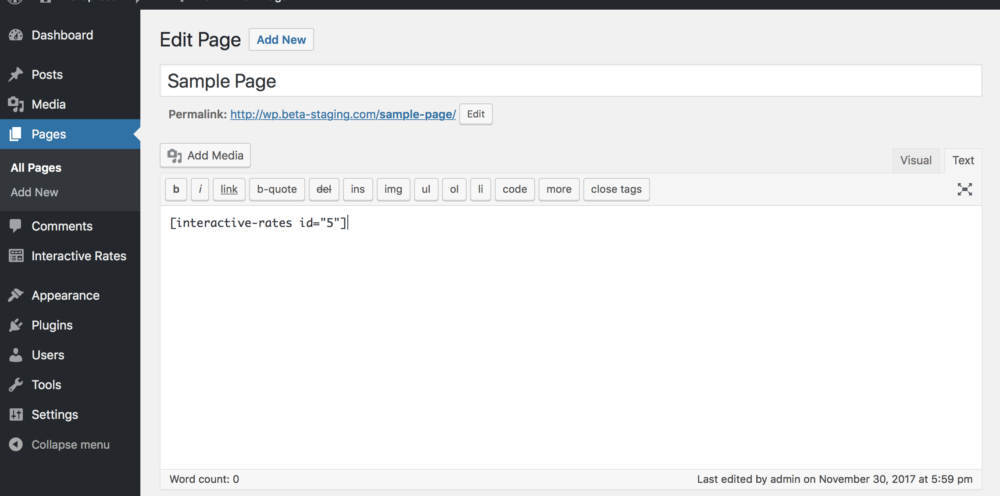

# Interactive widget to display delivery rates

# List of features

1. Owners can easily install it on any website;
2. Create any quantity of those widgets on each website;

3. Choose which kind of deliveries (small or long distance) this particular widget is related to;
4. Fill in the information, upload every single image via WordPress admin dash;
5. Customize the information for each stop (out of 6) of the slider;

6. Put short code into any page or post on the site.

